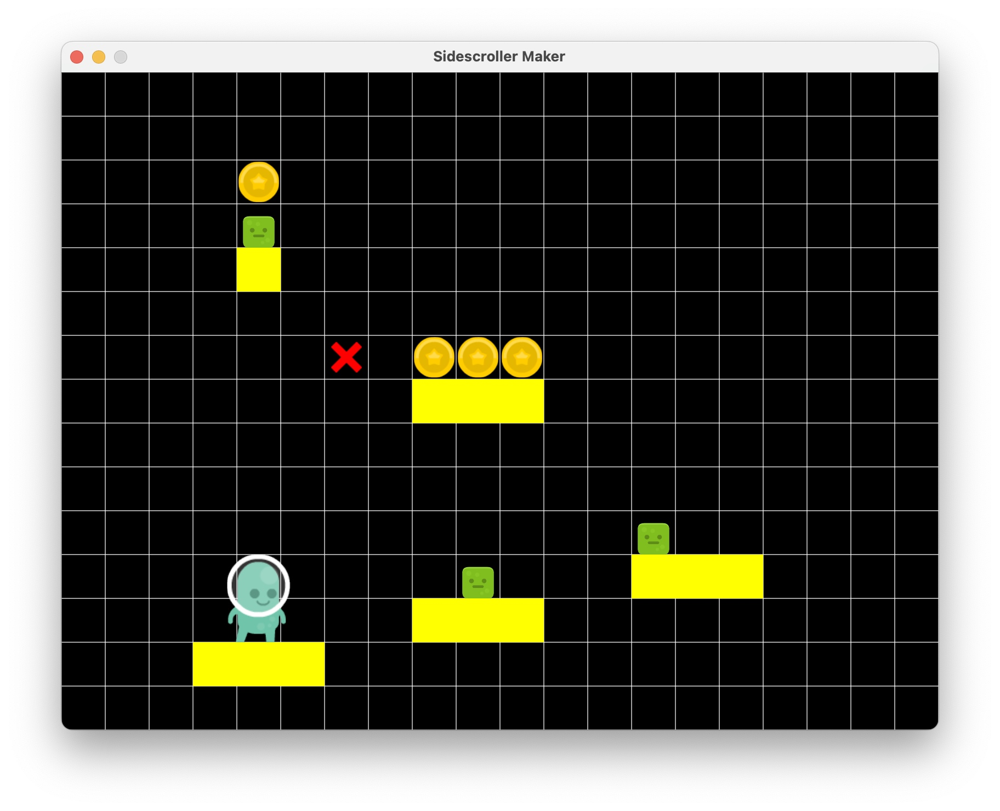
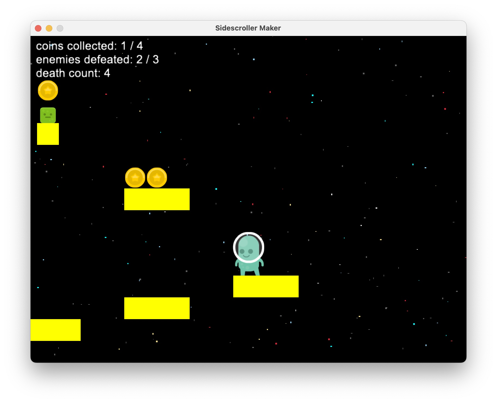

# Sidescroller Maker
A sidescroller maker and engine built with the Python Arcade library. Create, edit, and play your own 2D platformer levels - or use the built-in engine for custom games.

## Demo
### Video
[Watch video here](https://github.com/CadenLau/Sidescroller-Maker/raw/main/assets/gameplay/sidescroller_maker.mov)
### Screenshots
#### Level Maker

#### Level Gameplay

### Engine
See [`demo.py`](demo.py) for an example of how to use the engine.

## Installation
### 1. Clone the repository
    git clone https://github.com/CadenLau/Sidescroller-Maker.git
    cd Sidescroller-Maker
### 2. Create and activate virtual environment
#### macOS/Linux
    python3 -m venv venv
    source venv/bin/activate
#### Windows (PowerShell)
    python -m venv venv
    venv\Scripts\Activate.ps1
#### Windows (Command Prompt)
    python -m venv venv
    venv\Scripts\activate.bat
*Make sure you have Python 3.12+ installed. You can also upgrade pip to avoid dependency issues:*

    python -m pip install --upgrade pip
### 3. Install dependencies
    python -m pip install -r requirements.txt

## How to Run
    python main.py

## Usage
### Maker Controls
| Key | Action |
| ----------- | ----------- |
| Arrow keys | Move build cursor in arrow direction |
| 1 | Player build |
| 2 | Platform build |
| 3 | Enemy build |
| 4 | Coin build |
| 5 | Delete tool |
| Space | Place build (delete if using the delete tool) |
| Enter | Play level |

### Player Controls
| Key | Action |
| ----------- | ----------- |
| Up arrow | Jump |
| Down arrow | Duck |
| Left arrow | Move left |
| Right arrow | Move right |
| Space bar | Attack |
| Escape | Return to maker (if playing Sidescroller Maker) |

### Built-In Engine Functions
Create the window:

    make_window(width=800, height=600, title="Sidescroller Engine") -> arcade.Window
Create the game (make_window(), make_player(), and window.width * 2 will be assigned to [window], [player], and [level_width], respectively, when make_game() is run if no arguments are given for each):
    
    make_game(window: arcade.Window = None, player: Player = None, level_width=None, parallax_scroll=True, gravity=1.0) -> GameView
Create the player ([jumps] must be greater than 0):

    make_player(scale=1.0, start_x=100, center_y=200, jumps=2, jump_speed=20, movement_speed=8) -> Player
Create an enemy:

    make_enemy(center_x, center_y, scale=0.5) -> None
Create a coin:

    make_coin(center_x, center_y, scale=0.7) -> None
Create a platform:

    make_platform(center_x, center_y, width=300, height=40) -> None
Create a ground across the bottom of the entire level:

    make_ground() -> None
Run the game

    run(game: GameView) -> None

## Features
- Easy to use level builder
- Smooth, responsive controls
- Physics-based movement and hitbox detection
- Basic attack mechanic
- Lightweight engine for deeper level customization

## Project Structure
    ├── main.py
    ├── engine.py
    ├── view.py
    ├── assets/
    |   ├── gameplay/
    |   └── images/
    |       └── walk/
    ├── requirements.txt
    ├── LICENSE.txt
    ├── .gitignore
    └── README.md

## Built With
- [Python Arcade](https://api.arcade.academy/en/latest/)

## License
MIT License  
See [`LICENSE`](LICENSE.txt) file for details.